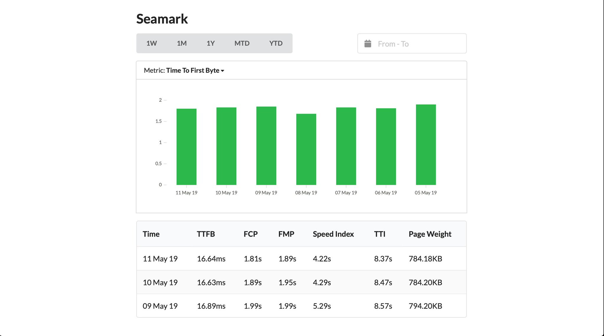

# Seamark

Web performance dashboard



## Local development

Prerequisites:

- Install `docker` and `docker-compose`

Start the containers

```shell
$ docker-compose up -d
```

SSH into the `seamark` container and run migrations

```shell
$ npm run migrate
```
